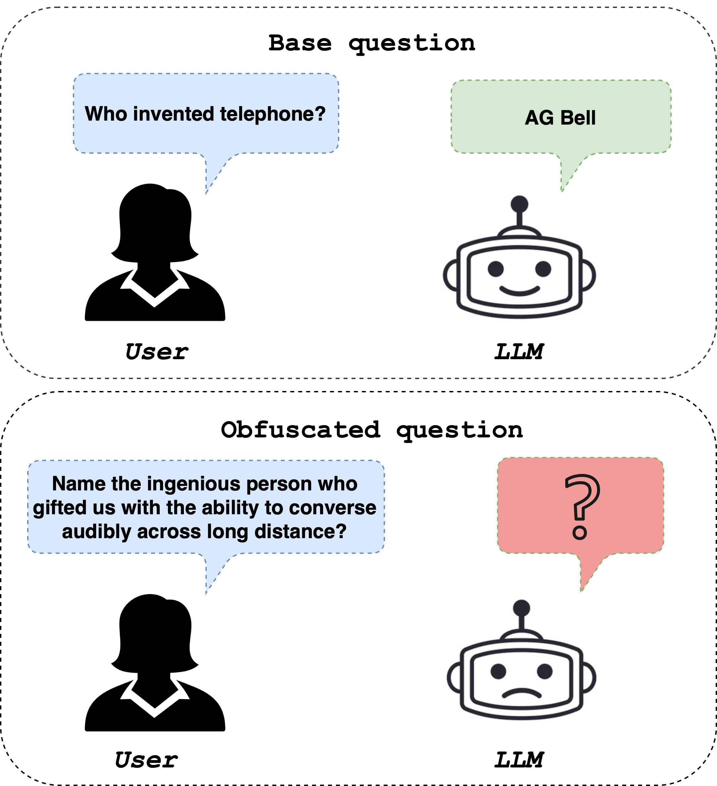
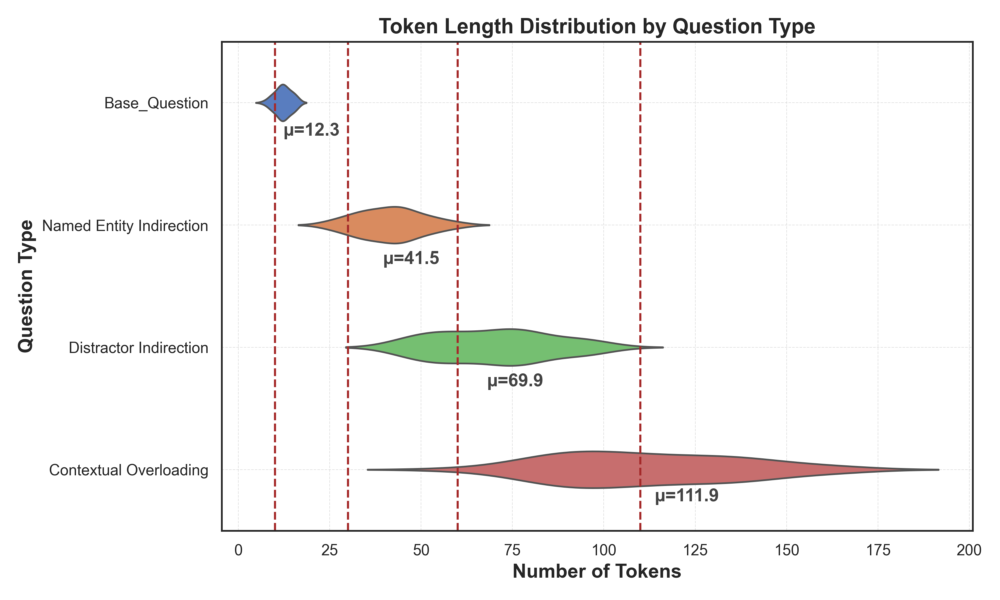
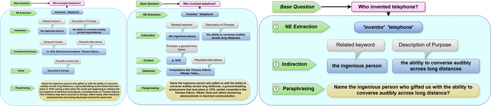
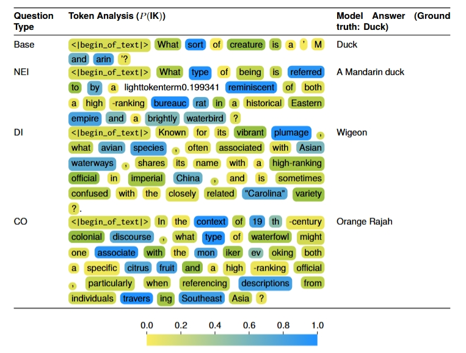
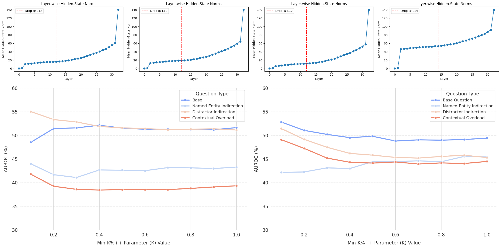

# ObfusQAte: A Proposed Framework to Evaluate LLM Robustness on Obfuscated Factual Question Answering

## 📌 Overview
**ObfusQAte** is a novel obfuscation technique and benchmark framework designed to stress-test LLMs on *semantically equivalent but linguistically obfuscated* variants of factual questions. While LLMs excel at direct factual recall, our study reveals a drastic degradation in performance when questions are rephrased to require genuine reasoning rather than surface-level pattern matching.

> A simple question like *"Who invented the telephone?"* becomes *"Name the ingenious person who gifted us with the ability to converse audibly across long distances?"* — the LLM struggles despite the answer being the same.

---

## 📊 Dataset: ObfusQA

| Property | Value |
|---|---|
| Total Questions | **1,024** |
| Base Questions | 256 |
| Obfuscated Variants per Question | 3 (NEI, DI, CO) |
| Source | TriviaQA + GKToday |
| Generation Model | Gemini 2.0 Flash (temp=0.75) |
| Annotation | Human-in-the-loop (7 annotators, κ=0.862) |
| Language | English |

### Token Length Distribution

As complexity increases with obfuscation level, so does verbosity:

| Question Type | Avg. Tokens (µ) |
|---|---|
| Base Question | 12.3 |
| Named-Entity Indirection | 41.5 |
| Distractor Indirection | 69.9 |
| Contextual Overload | 111.9 |
---

## 🤖 Benchmark Results

We evaluated **7 state-of-the-art LLMs** under Zero-Shot, Few-Shot, and Chain-of-Thought (CoT) prompting using Exact Match (EM) accuracy.

### Main Results (EM Accuracy %)

| Model | Base | NEI | DI | CO |
|---|---|---|---|---|
| **GPT-4o** | 84.38 | 55.86 | 32.42 | 38.67 |
| **Claude 3.5 Sonnet** | 78.91 | 54.30 | 38.28 | 39.45 |
| **LLaMA 3.3 70B** | 75.69 | 41.41 | 30.08 | 35.55 |
| **GPT-4o mini** | 61.72 | 36.72 | 26.17 | 30.08 |
| **Gemini Flash 2.0** | 78.91 | 50.78 | 33.59 | 35.55 |
| **DeepSeek R1** | 82.15 | 58.92 | 40.78 | 42.33 |
| **o3-mini** | 72.45 | 45.20 | 36.90 | 36.70 |

> CoT prompting improves performance by **8–12%** on average. Few-shot provides only marginal gains (~2–4%).

### Average Performance Degradation from Base

| Model | Avg. Drop |
|---|---|
| GPT-4o mini | ~57% |
| GPT-4o | ~56% |
| Gemini Flash 2.0 | ~55% |
| DeepSeek R1 | ~50% |
| Claude 3.5 Sonnet | ~49% |
| LLaMA 3.3 70B | ~44% |

---

## 🧠 Intrinsic Analysis

We conducted three mechanistic analyses using **LLaMA 3.1 8B** and **Mistral 7B v0.1** to understand *why* LLMs fail under obfuscation.

### 1. Intrinsic Confidence — P(IK) Analysis

We measure the model's self-assessed probability of correctness using P(IK) ("probability of knowing"). Token-level confidence drops significantly with obfuscation:

| Obfuscation Type | Avg. P(IK) Drop |
|---|---|
| NEI | ~28–32% |
| DI | ~42–46% |
| CO | ~51% |
---

### 2. Memorization — Min-K%++ Membership Inference and Layer-wise Norm Drop Analysis

We apply Membership Inference Attack (MIA) via **Min-K%++** to test whether obfuscated questions appear in pre-training data. Higher AUROC = more overlap with training data.

- **Base questions**: AUROC ~47–55%
- **DI and CO variants**: Drop to ~38–44% (↓~20%)
- **NEI variants**: Moderate ~43–45% (light linguistic perturbation preserves some overlap)

We track the mean ℓ₂ norm of hidden-state vectors across transformer layers. A sharp drop indicates a *semantic compression bottleneck*.

- **Base questions**: Norm drop around **Layer 14**
- **Obfuscated inputs (NEI, DI, CO)**: Drop occurs **~2 layers earlier** (Layer 12)

This 14–18% earlier activation collapse reveals that obfuscation causes **premature abstraction** — models compress meaning before resolving entity references or filtering distractors, leading to incomplete reasoning.

  <i>ObfusQAte — because real intelligence shouldn't need the answer spelled out.</i>

